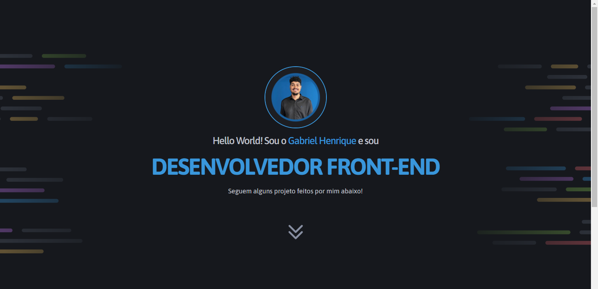

<h1 align="center"> Mini Portfólio </h1>

Desafio feito atráves do curso Fullstack da Rocketseat! Responsividade.

<a href="#-tecnologias">Tecnologias</a>&nbsp;&nbsp;&nbsp; |&nbsp;&nbsp;&nbsp;&nbsp;
<a href="#-projeto">Projeto</a>&nbsp;&nbsp;&nbsp;|&nbsp;&nbsp;&nbsp;
<a href="#-layout">Layout</a>&nbsp;&nbsp;&nbsp;|&nbsp;&nbsp;&nbsp;

## 🚀 Tecnologias

Esse projeto foi desenvolvido com as seguintes tecnologias:

- HTML e CSS
- Git e Github
- FIGMA

## 💻 Projeto

O Mini-Portfólio foi uma forma encontrada para expôr as 3 páginas refeitas utilizando agora da responsividade. Nele estão os seguintes projetos:

- Tech News: Uma página de notícias;
- TravelGram: Uma página para expôr fotos de viagens;
- Estrêla do amanhã: Um formulário de matrícula;

## 📘 Projeto feito como forma de estudos

Esse projeto foi feito como formato de estudos em colaboração com a Rocketseat.git